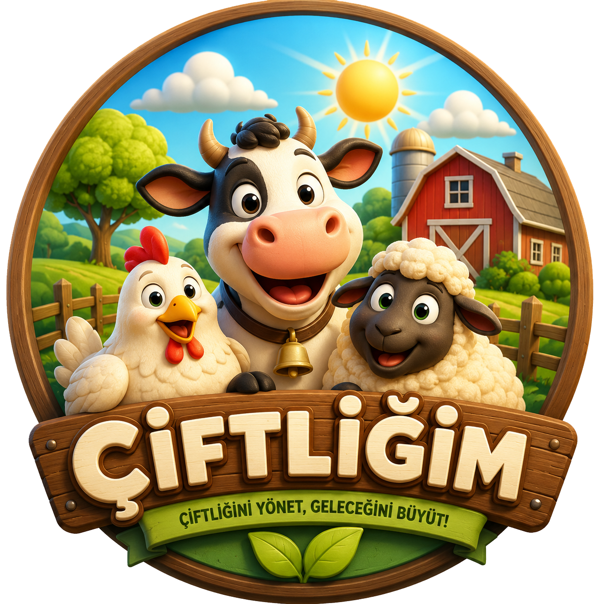

  

  # Çiftliğim

  Hayvancılık işletmenizi tek ekrandan yönetin: hayvanlar, ahırlar ve finans kayıtları.

---

## Hakkında

**Çiftliğim**, küçük ve orta ölçekli hayvancılık işletmeleri için geliştirilmiş, tek sayfalık (single-page) bir web uygulamasıdır. Firebase üzerinde çalışır ve tarayıcıdan veya bir WebView sarmalayıcı (native iOS/Android uygulaması) üzerinden kullanılabilir.

## Özellikler

- 🐄 **Hayvan Yönetimi** — Hayvan ekleme, düzenleme, küpe/isim takibi, gebelik durumu
- 🏠 **Ahır Yönetimi** — Ahır ekleme/düzenleme ve hayvanların ahırlara dağılımı
- 💰 **Finans Takibi** — Gelir/gider kayıtları, toplu hayvan satışı işlemleri
- 🔐 **Google ile Giriş** — Firebase Authentication üzerinden güvenli oturum açma
- 📱 **Mobil Uyumlu** — PWA desteği ve responsive arayüz

## Kullanılan Teknolojiler

- Vanilla JavaScript (framework'süz, tek dosya)
- Firebase (Auth + Firestore/Storage)
- Progressive Web App (PWA) desteği

## Çalıştırma

`index.html` dosyasını herhangi bir statik dosya sunucusuyla (veya doğrudan tarayıcıda) açmanız yeterlidir.

---

  Çiftliğim · Hayra vesile olsun 🤲

